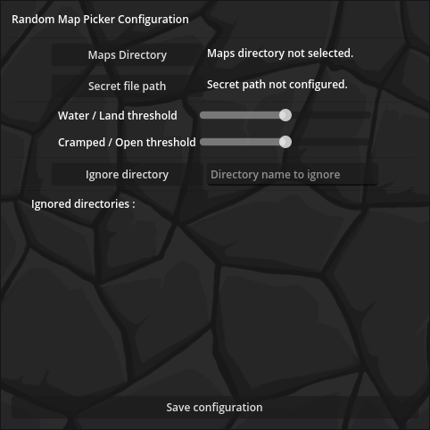
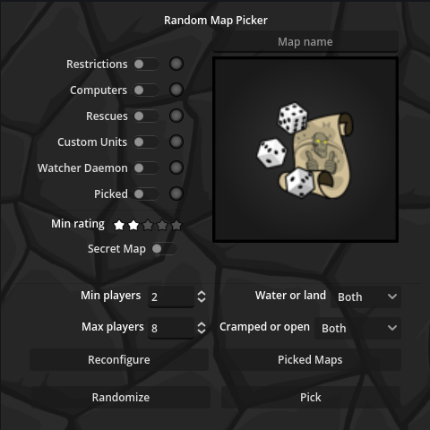
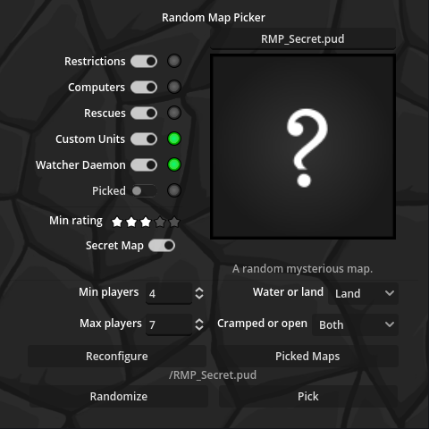

# Warcraft_II_Map_Picker
A very simple tool program that helps the user pick Warcraft 2 maps randomly within a provided folder.

This program was concieved on stream within 2 days mostly to add flavour to the Trogallart Twitch stream at:
(Trogallart twitch)[twitch.tv/trogallart]

###The program presents as follow:
A configuration panel for the first time setup allowing the user to set directories search rules and some constants.

A map  picker panel where the player can start randomly pick maps.
A set of filters is available to further customize the search.

When picking a map with applied filters:

When requesting a secret map with hidden informations:

*For any question regarding Warcraft II or this program head to the Trog's (Discord)[https://discord.com/invite/ADt3TgFuV7]*

Have a great day!
